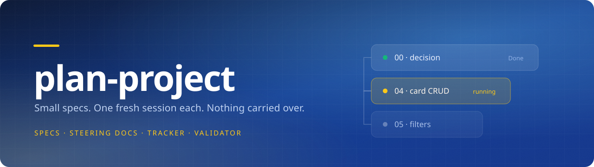
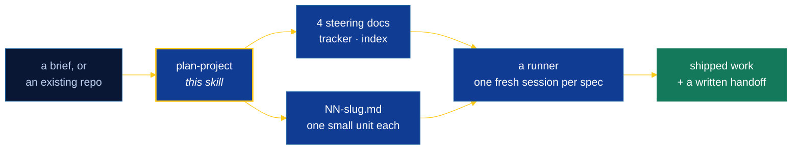

<div align="center">



<br>

[](#install)
[](#what-each-agent-actually-gets)
[](#requirements)
[](#requirements)
[](#licence)

**by M Shahzad**

</div>

<br>

A skill that turns a brief — or an existing repository — into a set of very
small, dependency-ordered spec files that a fresh, context-free agent session
can pick up one at a time. Works in [Claude Code](https://claude.com/claude-code),
OpenAI Codex, Cursor, Google Antigravity, Windsurf, GitHub Copilot, Cline, Roo
Code, and every agent that reads [AGENTS.md](https://agents.md).

Each spec is small enough that one session can read it, implement it, verify it
end to end, and leave a written handoff. **The skill plans; it does not implement.**



<br>

## What it produces

```
<project>/specs/
  README.md              index — one table, every spec, dependency order
  PROGRESS.md            the tracker — status table + append-only dated log
  AGENT-GUIDE.md         how an implementing agent works in this repo
  ARCHITECTURE.md        folders, layers, boundaries, data model, invariants
  DESIGN-SYSTEM.md       the closed token list: colour, type, space, motion, states
  INVENTORY.md           reuse registry — what already exists, so nothing is rebuilt
  00-<decision>.md       a blocking decision, not a coding task
  01-<slug>.md           …one small unit each
  NN-verification-pass.md   the final gate
```

Four steering docs, one tracker, one index, and many small specs. Steering docs
are written once and read by every spec. Specs are disposable units of work.

<br>

## Three things every spec carries

### 

The intake asks one question with four answers, because a branded project and an
unbranded one produce different specs from the first UI unit onward:

| Answer | What happens |
| --- | --- |
| **Zeki branding** | The author's house brand — navy/yellow palette, Poppins, the logo files in `assets/zeki/`. `DESIGN-SYSTEM.md` comes pre-filled from `references/brand-zeki.md`; the first UI spec copies the logos into the project |
| **User-supplied** | Your palette, brand kit, reference site or Figma file — transcribed verbatim, nothing invented around it |
| **Model decides** | Decided in full — palette, type, spacing, radii, elevation, motion — one line of rationale each |
| **No UI** | `DESIGN-SYSTEM.md` is skipped, and `README.md` says so rather than omitting it silently |

> [!IMPORTANT]
> The result is a **closed list**: a token that is not in `DESIGN-SYSTEM.md` does
> not exist, and that file is the only place in the repo allowed to hold a raw
> hex value. Inventing a plausible-sounding variant locally is the failure mode
> this rule exists to stop.

### 

Each spec's `**Model:**` header line carries a tier and one model per provider,
chosen from how much of the system a mistake in that spec would damage:

| Tier | Anthropic | OpenAI | Google | For |
| --- | --- | --- | --- | --- |
|  | `claude-opus-5` | `gpt-6-astra` | `gemini-3.1-pro-preview` | Decisions, the data model, auth, routing, shared layers, the verification pass |
|  | `claude-sonnet-5` | `gpt-6-sol` | `gemini-3.8-flash` | Most feature-sized units |
|  | `claude-haiku-4-5` | `gpt-6-luna` | `gemini-3.5-flash-lite` | Config, copy, scaffolding, transcription |

```markdown
**Model:** Standard — `claude-sonnet-5` · `gpt-6-sol` · `gemini-3.8-flash`
```

A runner can read that line and start the session on the named model —
[`spec-run`](https://github.com/mplus-s/command-center-linux-ubuntu) does.

> [!NOTE]
> Model lineups move faster than any file does. `references/model-selection.md`
> records the date its ids were verified and tells the planner to re-check them
> against the providers' own model pages before writing a set. A plausible id
> that does not exist is the same defect class as a hallucinated library export.

### 

One spec is one issue is one pull request. The implementing session, not the
planner:

1. **Searches before creating** — `gh issue list --state all --search "Spec 04 in:title"`.
   An issue titled `Spec 04 — …` already exists on any re-run; opening a second
   one is the failure this ordering prevents.
2. Creates it if it is genuinely missing, assigns it, and writes `#n` into the
   spec's `**Issue:**` header and the tracker row — **before** any code.
3. Opens a PR with `Closes #n` once the `Done when` checks actually pass, and
   moves the issue to Done on the board if the repo has one.

> [!WARNING]
> The session never merges its own PR. The PR is the human review gate, and a
> spec queue that merges itself has no gate at all. `gh` failing is logged, not
> fatal, and the whole workflow is skipped when the project has no GitHub remote.

<br>

## Install

```bash
npx github:mplus-s/plan-project
```

It installs straight from this repo — there is nothing on the npm registry, so
that is the command, and `git` has to be on your PATH for npx to fetch it. Pin a
release by appending a ref: `npx github:mplus-s/plan-project#v0.2.0`.

Run it in your repo. It shows a picker with the agents it detected already
ticked — space to toggle, `a` for all, enter to install:

```
 Which agents should it install into?
   ↑↓ move · space toggle · a all · enter install · esc cancel

   ◯ Claude Code            full skill, progressive disclosure, Skill tool
   ◯ OpenAI Codex           SKILL.md skill at .agents/skills/ — full fidelity
 ❯ ◉ Cursor                 detected · Apply Intelligently
   ◯ Google Antigravity     workspace rule in .agents/rules/
   ◯ Windsurf               trigger: model_decision
   ◯ GitHub Copilot         applyTo: specs/**
   ◯ Cline                  plain rule file
   ◯ Roo Code               plain rule file
   ◉ AGENTS.md              Codex, Gemini CLI, Aider, Zed, Amp, Jules…
```

Re-running updates in place; it never overwrites a file it did not write.

```bash
npx github:mplus-s/plan-project --list          # what's detected here, changes nothing
npx github:mplus-s/plan-project --dry-run       # what would be written, changes nothing
npx github:mplus-s/plan-project --all           # every supported agent, detected or not
npx github:mplus-s/plan-project --agents cursor,claude,codex
npx github:mplus-s/plan-project -y              # skip the picker, take what's detected
npx github:mplus-s/plan-project --global        # install for all projects, not just this one
```

### How it installs

The content is ~412KB (228KB of it optional brand assets) and `SKILL.md` alone
is 16,369 characters — more than Windsurf allows in a single rule file, and far
more than you want billed on every Cursor request. So it goes in **once**, and
each agent gets a short adapter pointing at it:

```
.ai/plan-project/                 the content — one copy
.claude/skills/plan-project       → symlink   (Claude Code, native)
.agents/skills/plan-project       → symlink   (Codex, native)
.cursor/rules/plan-project.mdc    description-triggered, alwaysApply: false
.agents/rules/plan-project.md     Antigravity workspace rule
.windsurf/rules/plan-project.md   trigger: model_decision
.github/instructions/plan-project.instructions.md
.clinerules/plan-project.md  ·  .roo/rules/plan-project.md
AGENTS.md                         an appended section, your content untouched
```

> [!TIP]
> Commit `.ai/plan-project/` and the adapters so your team gets it too.

### What each agent actually gets

Support is real but not uniform, and it is worth knowing which tier you are in:

| Tier | Agents | What happens |
| --- | --- | --- |
| **Native** | Claude Code, OpenAI Codex | A real skill — both read the `SKILL.md` format, so they get progressive disclosure and invoke it as a skill |
| **Model-decides** | Cursor, Google Antigravity, Windsurf, GitHub Copilot, Cline, Roo Code | The agent pulls the rule in when it judges it relevant, then follows the pointer. Usually works; ask for it by name if it doesn't |
| **Always-on** | Codex, Gemini CLI, Aider, Zed, Amp, Jules, Warp, Junie, goose, opencode and the rest of [AGENTS.md](https://agents.md) | A section in `AGENTS.md`. Widest reach, weakest targeting |

Claude Code and Codex both read the `SKILL.md` format, so they get the skill as
designed — a short always-loaded entry point with references pulled in on
demand. Everywhere else the adapter is a router: it carries the rules that
matter and tells the agent which reference to open next.

### Requirements

Node 18+ and `git` for the installer (npx clones the repo). The validator is
Python — `python3` on PATH to run it. Nothing else; the installer has zero
dependencies.

<br>

## The validator

A spec set is not finished because it reads well:

```bash
python3 ~/.claude/skills/plan-project/scripts/validate-specs.py <project>/specs
```

Exit `0` clean (warnings allowed) · `1` errors · `2` no spec set found. It
mechanically checks the things that actually go wrong:

- header keys present, `Status` in the four-word vocabulary, `## Log` last
- `Model` names a tier and one id per provider, with a `claude-*` id a runner
  can use, and the verification pass tiered `Heavy`
- `Issue` is `—` or `#<number>`, and is set on any spec past `Not started`
- dependencies resolve, and never point forward
- no two specs list the same path in `Owns`
- every `Explicit non-scope` deferral names a target spec that exists
- every `Reuses` path is on disk or owned by an earlier spec
- every `Done when` bullet carries a verifiability tier, and every spec has a
  `[static]` gate; every UI spec has an end-to-end one
- a whole-suite test run mistagged as a scoped `[e2e]`, and a spec set with no
  checkpoint before the final verification pass
- tracker rows match the spec files, one for one
- warns on code blocks in specs, raw hex outside `DESIGN-SYSTEM.md`, specs over
  130 lines, and anything created that no other spec ever mentions

<br>

## Ideas it is built around

- **A feature is several specs, not one.** Data layer → API → UI shell →
  interactions → polish. Length correlates with trouble, not clarity.
- **`Explicit non-scope` is mandatory, and every deferral names its target
  spec.** A deferral with no target excludes work nobody will ever do.
- **`Done when` is binary and tiered** — `[static]`, `[runtime]`, `[e2e]`,
  `[suite]`, `[requires: …]` — never "the flow works well".
- **End-to-end proof is scoped.** Every user-facing spec runs its own test file
  plus a capped smoke set; the whole suite is gated only at checkpoints and the
  final verification pass, so execution time stays flat as the set grows.
- **Ground every claim.** A path, a package, a library export, a prior state —
  checked against the real tree before it goes into a spec.
- **Reuse before creating.** `INVENTORY.md` makes "does this already exist?"
  answerable in one read.
- **Size the model to the spec, not to the set.** A config spec and an auth spec
  are not the same problem; the planning session is the only point where the
  whole set is visible at once, so that is where the call belongs.
- **Surface decisions, never bury them.** A fork with real cost either way gets
  written down with a recommendation and left for a human.

<br>

## Layout

```
SKILL.md                 the procedure — kept short, it is always loaded
references/              progressive disclosure; loaded only when relevant
  spec-format.md         the spec file format
  steering-docs.md       required sections of the four steering docs
  model-selection.md     the three tiers and which spec belongs in which
  github-workflow.md     issue-per-spec, PR-per-spec, with the gh commands
  brand-zeki.md          the optional house brand: palette, type, logo rules
  splitting.md           sizing rules and a worked split
  reuse-inventory.md     INVENTORY.md and the duplication sweep
  e2e-playwright.md      the end-to-end obligation, per stack
  stack-patterns/        react-node.md (house rules) · unknown-stack.md (research)
templates/               copy-and-fill starting points
  DESIGN-SYSTEM-zeki.md  the token list, pre-filled with the house brand
assets/zeki/             the brand logo files, with provenance in its README
scripts/validate-specs.py   the mechanical check
```

<br>

## Licence

MIT © M Shahzad
